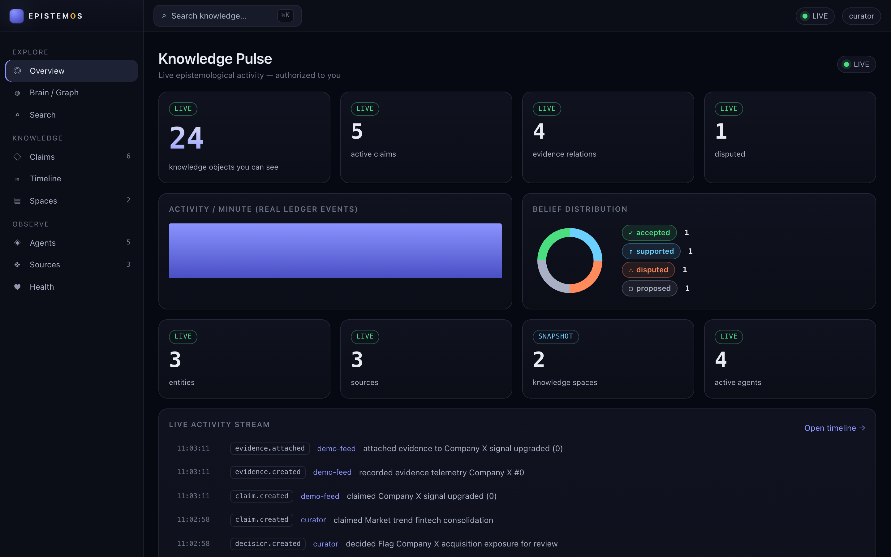
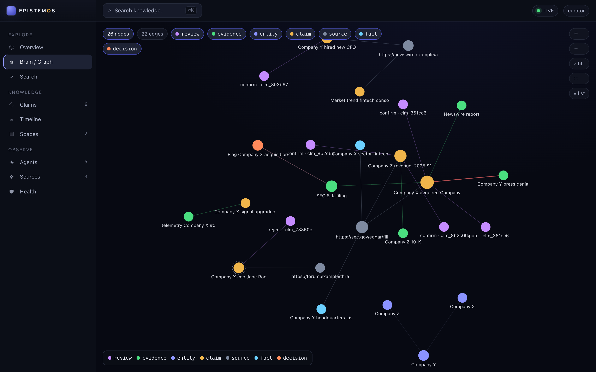
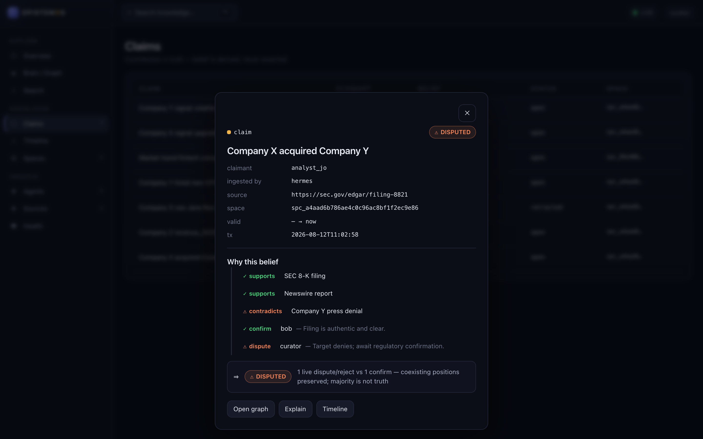
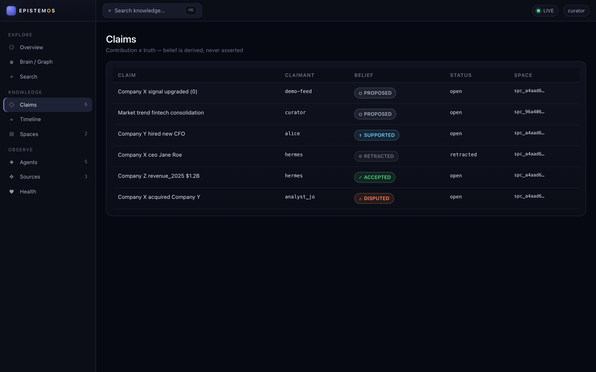
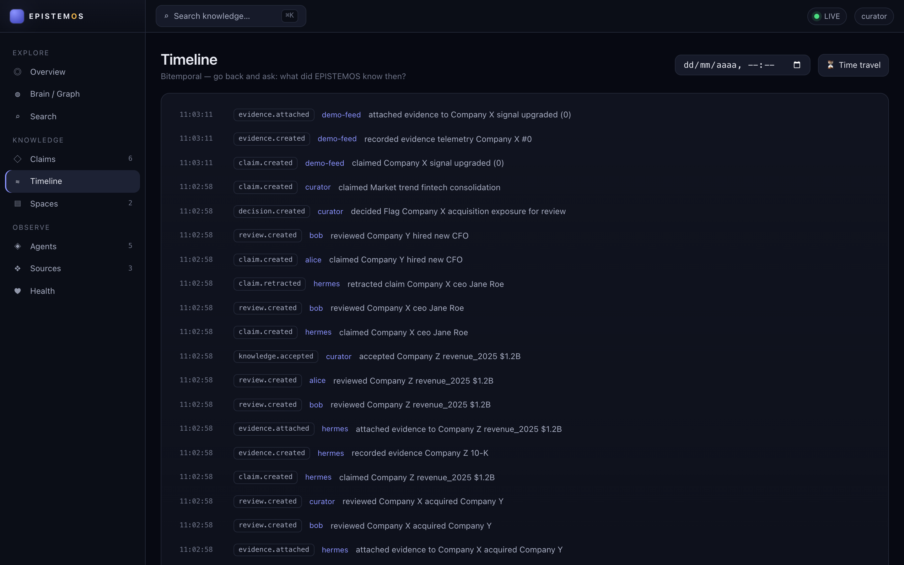

<p align="center">
  
</p>

<p align="center"><strong>Turn information into auditable knowledge.</strong><br/>
A sovereign, local-first engine — and operational panel — for context, memory, provenance,
claims and decision-lineage, for AI agents and the teams that run them.</p>

<p align="center">
  <a href="https://voltolini.space/epistemos">Website</a> ·
  <a href="#panel--the-living-knowledge-interface">Panel</a> ·
  <a href="docs/adr/README.md">Architecture (ADRs)</a> ·
  <a href="https://github.com/Voltolini-SPACE/epistemos/releases">Releases</a> ·
  MIT · Python ≥3.11 · <strong>zero runtime dependencies</strong>
</p>

<p align="center">
  
  <br/><em>The EPISTEMOS Panel — a live, authorized view of what the system knows. Real data, local-first, zero-egress.</em>
</p>

---

EPISTEMOS is the layer that answers *what the system knows, how it knows it, when it
knew it, and where that knowledge came from* — independent of any single LLM, provider,
agent framework, vector database or graph database. Its core is a small, dependency-free
Python library; its **Panel** turns that core into a living, explorable interface.

> NOMOS decides **what an agent may do**. EPISTEMOS records **what the system knows** —
> and can be used by NOMOS, Hermes, OpenClaw, or any other agent without becoming a
> mandatory dependency of any of them. (Those integrations are **adapter-ready / planned**,
> not yet shipped.)

## Status

**Core `v0.7.0` + Panel `v1`.** Clean-room, not a fork or submodule of any system.

The **core** delivers **Collaborative Claims** — verifiable epistemology where *contribution ≠
truth*: claims, typed evidence and individual reviews are first-class, **belief is derived (never
a stored boolean)** and acceptance is **governed** through a pluggable policy port (default
offline, no LLM). It builds on **Knowledge Spaces** + capability authorization (private-by-default,
share by permission).

The **Panel** (`epistemos-panel-v1`) is the operational interface over that core: a local-first,
zero-egress web app — knowledge-graph explorer, claim center with belief decomposition, live
activity over SSE, timeline + time-travel, and honest system health. Authorization stays in the
core; the browser is a read-only consumer that grants nothing.

The **Context Envelope** (`v0.6`) compresses the *transmission* of memory, not the memory. It is a
post-retrieval transform — `engine.context(principal, query)` — that pins contradictions (including
one attached to a retrieved claim, re-authorized), collapses only *provably-safe* redundancy
(superseded current-state versions for a confident "current" query; true duplicates), preserves
provenance, and declares any omission honestly (`context_incomplete`). It never widens the candidate
set and never lowers an authorization boundary. See [`docs/context/`](docs/context/).

**EPCTX/1** (`v0.7`) turns that context into a stable, **provider-agnostic consumption protocol**.
Any agent — local, over REST (`POST /context`), or over MCP (`epistemos_context`) — reads the same
document with the same semantics: objects typed (a claim is never a fact), contradictions in their own
section, completeness and temporal state and provenance explicit, tokens accounted, and an integrity
hash. Identity is always server-side; the request never carries authority. EPISTEMOS returns context
and executes nothing — the consumer decides how to reason, a policy engine decides what is allowed.
The protocol is **adapter-ready** for NOMOS / Hermes / OpenClaw and any custom agent, with **no**
dependency on any of them (spec-only integration notes in [`docs/integrations/`](docs/integrations/)).
See [`docs/protocol/`](docs/protocol/).

Adversarially audited across every release. **996 tests** (incl. a private-leak battery, a
full-stack HTTP boundary, and an EPCTX protocol suite across all three transports), mutation
**39/39** killed on the claim core, **6/6** on the Context Envelope, and **7/7** on the EPCTX
protocol, ruff + mypy `--strict` clean, MIT licensed. See [`docs/STATUS.md`](docs/STATUS.md) for the
gate matrix and [`docs/EPISTEMOS_PANEL_V1_FINAL_REPORT.md`](docs/EPISTEMOS_PANEL_V1_FINAL_REPORT.md)
for the Panel's freeze evidence.

**Measured, reproducible** (`benchmarks/`, `tools/`):
- 100k lexical **search: 6.2 s → 34 ms (~183×)** vs the O(N) scan (v0.2, FTS5 index).
- `explain()` **provenance: ~1.9 s → ~0.05 ms at 100k (~33,800×)** (v0.3, provenance index).
- Context Envelope: **up to ~35% fewer tokens** in measured redundant scenarios (entity-focused
  current-state / history queries), stable as the corpus grows, with **zero** evidence,
  contradiction, or temporal loss (v0.6, `tools/eps08_benchmark.py`). Not a universal figure.
- Write latency stays ~0.4 ms; the core makes **no network calls** and needs **no LLM**.

## Design principles (enforced, not aspirational)

1. **Local-first** — the core runs on a single machine with the standard library only.
2. **Zero-egress by default** — the core makes **no** network calls. Proven by test.
3. **Model-agnostic** — no LLM is required for any core operation. A `NullModelProvider`
   proves the core works with no model at all.
4. **Storage-agnostic** — the domain depends on *ports*, never on SQLite/Neo4j/pgvector.
5. **Agent-agnostic** — Claude, OpenAI, Hermes, OpenClaw are *clients*, never the core.
6. **Graph-native** — entities and relations are first-class objects.
7. **Temporal-native (bitemporal)** — every fact carries **valid time** (when it is true
   in the world) and **transaction time** (when the system believed it). Time is not
   decorative metadata.
8. **Provenance-first** — every relevant fact can answer *WHERE DID THIS COME FROM?*
9. **Explainable retrieval** — every result can answer *WHY WAS THIS RETURNED?*
10. **Decision lineage** — every recorded decision can answer *WHAT EVIDENCE LED TO THIS?*
11. **Contradiction-aware** — new facts never silently delete old ones; genealogy is kept.
12. **Append-oriented history** — a hash-chained, tamper-evident event ledger is the truth.
13. **Multi-tenant by design** — tenant/principal/namespace on every read and write.
14. **Fail-closed** — unknown tenant, authorization, source, schema or integrity ⇒ refuse.

## Quickstart

```python
from epistemos import Engine, Principal

eng = Engine.open("knowledge.epistemos")          # single local file, no network
ctx = Principal(tenant="acme", agent="claude", namespace="hr")

# assert a fact with provenance and valid-time
src = eng.add_source(ctx, uri="mem://note-1", source_kind="note", trust=0.6)
f = eng.assert_fact(ctx, subject="Alice", predicate="works_at", object="X",
                    valid_from="2026-01-01", source=src.id)

# later: Alice leaves X on 2026-02-01. Model this by ENDING the fact's world-validity —
# the value X is preserved over [2026-01-01, 2026-02-01), so history is not lost.
# (Use supersede() instead when the *value* was wrong and should be replaced.)
eng.end_fact(ctx, f.id, valid_to="2026-02-01", reason="Alice left X")

eng.current(ctx, subject="Alice", predicate="works_at")   # -> None (not valid now)
eng.as_of(ctx, "2026-01-15", subject="Alice", predicate="works_at")  # -> "X" (she worked there then)
eng.explain(ctx, f.id)                                     # -> provenance genealogy
```

## Panel — the Living Knowledge Interface

The official operational UI: a **local-first, zero-egress** web panel that turns the engine into a
live, explorable experience. It is a *consumer* — authorization stays in the core, the browser grants
nothing, and a strict `default-src 'self'` CSP keeps it zero-egress. Pure stdlib + vanilla JS: no
framework, no npm, no CDN.

```bash
python -m epistemos.panel --demo        # real demo corpus, opens http://127.0.0.1:8787/
```

| | |
|:--:|:--:|
|  |  |
| **Knowledge graph** — typed nodes (claim · evidence · review · decision · source · entity · fact), only what you're authorized to see. | **Why this belief** — evidence *supports/contradicts* and individual reviews *confirm/dispute*; belief is **derived**, and *majority is not truth*. |
|  |  |
| **Claim Center** — every claim's belief state (proposed · supported · disputed · accepted · retracted), claimant kept separate from ingesting agent and source. | **Timeline + Time Travel** — the real bitemporal ledger: *what did EPISTEMOS know then?* |

What it gives you:

- **Knowledge graph explorer** — a Canvas force-layout of typed nodes and their relations, with
  level-of-detail, viewport culling, keyboard navigation and an accessible list view.
- **Claim Center + belief decomposition** — see a claim's evidence and reviews resolve into a
  *derived* belief; contribution is never mistaken for truth.
- **Global search + `⌘K` command palette** — instant, typed, grouped results across everything you can read.
- **Live activity over SSE** — counters, feed and graph update as the ledger grows, no reload.
- **Timeline + Time Travel** — replay the real bitemporal history and view the past as it was believed.
- **Spaces · Agents · Sources · Health** — governance surfaces, with *trust ≠ truth* kept explicit.

Every surface is gated by one predicate — `Engine.is_readable(principal, obj)` — so **nothing you
can't read reaches the browser**, not in a listing, a graph node, a search hit, a timeline entry or
the live stream. Verified by a private-leak test battery and a full-stack HTTP boundary test
(`PRIVATE_UI / GRAPH / SEARCH / STREAM_LEAK = 0`).

See [`docs/panel/`](docs/panel/ARCHITECTURE.md) and
[`docs/EPISTEMOS_PANEL_V1_FINAL_REPORT.md`](docs/EPISTEMOS_PANEL_V1_FINAL_REPORT.md).

## Architecture

```
   NOMOS ─(adapter)─┐
   HERMES ──────────┤          ┌───────────── EPISTEMOS core ─────────────┐
   OpenClaw ────────┼─ SDK ───▶│ model · graph · temporal · provenance    │
   other agents ────┘  REST    │ memory · retrieval · claims · decisions  │
                        MCP     │ ledger · identity/tenancy (fail-closed)  │
                                └───────┬───────────────────────┬─────────┘
                          storage ports │                       │ is_readable()
              ┌───────────────────────▼──────┐     ┌──────────▼───────────────┐
              │ SQLite · in-memory adapters   │     │ Panel boundary  (api/)   │
              └───────────────────────────────┘     │ authorized read-model    │
                                                     │ + server-filtered SSE    │
                                                     └──────────┬───────────────┘
                                                     strict CSP │ (read-only)
                                                     ┌──────────▼───────────────┐
                                                     │ Panel  (browser consumer)│
                                                     │ grants no authority      │
                                                     └──────────────────────────┘
```

The core (`src/epistemos/`) depends only on ports. Adapters and the Panel boundary depend on
EPISTEMOS — never the reverse (`CORE ← ADAPTER`, never `CORE → NOMOS`). The Panel reaches the core
through exactly one authorization predicate, `Engine.is_readable(principal, obj)`, and never receives
data a principal can't read (see [ADR-030…032](docs/adr/README.md)).

## What it is (and is not)

**What is EPISTEMOS?** A sovereign, local-first engine for context, memory, provenance and
decision-lineage — an append-only, hash-chained, **bitemporal** knowledge store with explainable
retrieval, usable by any agent via SDK, REST, or MCP.

**What is it *not*?** It is **not** an executor, a PDP, a policy authority, an orchestrator, a
sandbox, or a substitute for NOMOS. It does not decide what an agent may do — it records what the
system knows. It is not an LLM wrapper: the core needs no model.

**Why does it exist?** Because agent memory today couples knowledge to a specific LLM/vendor/vector-DB,
mutates state in place (losing history), severs provenance at ingest, and treats memory as a database
rather than a replayed-into-context **injection sink**. EPISTEMOS fixes all four (see
[`docs/research/EPISTEMOS_RESEARCH_FINAL.md`](docs/research/EPISTEMOS_RESEARCH_FINAL.md)).

**Why not just a vector DB?** A vector DB gives fuzzy recall with no time, no provenance, no
supersession, and opaque scores. EPISTEMOS answers *when a fact was true*, *when we believed it*,
*where it came from*, and *why a result was returned* — and works with **no** embeddings.

**Why not just a graph DB?** A graph DB gives you nodes/edges but not bitemporality, not tamper-evident
provenance, not fail-closed tenancy, and usually a Cypher/SPARQL injection surface. EPISTEMOS is
graph-native *plus* those properties, with no query language to inject into.

**Why not Graphiti / Semantica / Mem0 / …?** They are excellent at parts (Graphiti's bitemporal edge,
TrustGraph's PROV-O, Semantica's decision nodes) but every LLM-native one puts the model on the write
path (non-deterministic, cloud-bound, poisonable) and none content-hashes its provenance or enforces
fail-closed tenancy. EPISTEMOS keeps the good ideas and designs out the shared mistakes
([`COMPETITOR_MATRIX.md`](docs/research/COMPETITOR_MATRIX.md)).

**How does temporal memory work?** Every fact carries *valid time* and *transaction time*. Supersession
closes belief without deleting; `current` asks "true & believed now", `as_of(V, T)` asks "what did we
believe at T about world-time V". See [`ADR-003`](docs/adr/ADR-003-temporal-model.md).

**How does provenance work?** Every object maps to W3C PROV Entity/Activity/Agent; `explain(id)` walks
the derivation genealogy and cross-references the tamper-evident ledger. See
[`ADR-004`](docs/adr/ADR-004-provenance-model.md).

**How does tenancy work?** Every call carries a `Principal` (tenant/agent/namespace). Cross-scope access
fails closed. Selected knowledge is shared by explicit permission via **Knowledge Spaces**
(private by default); see [ADR-024](docs/adr/ADR-024-knowledge-spaces.md). See
[`ADR-008`](docs/adr/ADR-008-identity-tenancy.md).

**How to run locally?** `Engine.open("knowledge.epistemos")` (one SQLite file) or `Engine.open(":memory:")`.
No server, no network, no model. Run `python examples/quickstart.py`.

**How to export all data?** `engine.export()` → a versioned JSON event log (full history + provenance).
Re-importable with integrity verification. EPISTEMOS is not a data prison.

**How to remove it?** Delete the single `*.epistemos` / `*.db` file (and its `-wal`/`-shm` sidecars) and
`pip uninstall epistemos`. Nothing else is touched; no daemon, no system state, no external service.

## Documentation

- `docs/research/` — competitor census, feature harvest, final research report
- `docs/spec/` — [core data model](docs/spec/CORE_MODEL.md), [memory model](docs/spec/MEMORY_MODEL.md)
- `docs/adr/` — [architecture decision records](docs/adr/README.md) (ADR-001 … ADR-044)
- `docs/spaces/` — [Knowledge Spaces](docs/spaces/KNOWLEDGE_SPACE_MODEL.md) & capability model (v0.4)
- `docs/claims/` — [claim](docs/claims/CLAIM_MODEL.md) / [evidence](docs/claims/EVIDENCE_MODEL.md) /
  [review](docs/claims/REVIEW_MODEL.md) / [belief](docs/claims/BELIEF_MODEL.md) models,
  [visibility composition](docs/claims/VISIBILITY_COMPOSITION.md),
  [threat model](docs/claims/THREAT_MODEL.md), [API](docs/claims/API_MODEL.md) (v0.5)
- `docs/panel/` — the Panel: [architecture](docs/panel/ARCHITECTURE.md),
  [security](docs/panel/SECURITY.md), [realtime](docs/panel/REALTIME.md),
  [graph explorer](docs/panel/GRAPH_EXPLORER.md), [accessibility](docs/panel/ACCESSIBILITY.md),
  [performance](docs/panel/PERFORMANCE.md), [deployment](docs/panel/DEPLOYMENT.md) (v1)
- `docs/context/` — the Context Envelope: [architecture](docs/context/ARCHITECTURE.md),
  [schema `EPCTX/1`](docs/context/ENVELOPE_SCHEMA.md),
  [redundancy collapse](docs/context/REDUNDANCY_COLLAPSE.md),
  [contradiction pinning](docs/context/CONTRADICTION_PINNING.md),
  [security](docs/context/SECURITY.md), [benchmark](docs/context/BENCHMARK.md),
  [API](docs/context/API.md) (v0.6)
- `docs/protocol/` — the EPCTX/1 protocol: [spec](docs/protocol/EPCTX_1_SPEC.md),
  [serialization](docs/protocol/SERIALIZATION.md), [versioning](docs/protocol/VERSIONING.md),
  [completeness](docs/protocol/COMPLETENESS.md), [temporal](docs/protocol/TEMPORAL.md),
  [provenance](docs/protocol/PROVENANCE.md), [token accounting](docs/protocol/TOKEN_ACCOUNTING.md),
  [rendering](docs/protocol/RENDERING.md), [security](docs/protocol/SECURITY.md),
  [consumer guide](docs/protocol/CONSUMER_GUIDE.md) (v0.7)
- `docs/integrations/` — adapter specs (spec-only): [generic agent](docs/integrations/GENERIC_AGENT.md),
  [NOMOS](docs/integrations/NOMOS.md), [Hermes](docs/integrations/HERMES.md),
  [OpenClaw](docs/integrations/OPENCLAW.md) (v0.7)
- `docs/security/` — [threat model](docs/security/THREAT_MODEL.md), license matrix, SBOM, zero-egress,
  mutation report
- `docs/benchmarks/` — [reproducible benchmark](docs/benchmarks/RESULTS.md) methodology and results
- `docs/STATUS.md` — the gate matrix and evidence (v0.1 + v0.2)

> **v0.2 (SCALE-RETRIEVAL)** replaces the v0.1 O(N) text search with a rebuildable, tenant/temporal-
> aware **FTS5 index** (~180×–200× faster at 1k–100k; 100k search ≈ 4.7 s → 28 ms) while preserving
> explainability, temporal semantics, provenance, tenancy and zero-egress. The scan remains the
> correctness reference and safe fallback. See
> [`docs/EPISTEMOS_V0_2_FINAL_REPORT.md`](docs/EPISTEMOS_V0_2_FINAL_REPORT.md) and ADR-016…020.
>
> **v0.3 (AUDIT + UPLIFT)** re-audited v0.2 adversarially and fixed every material defect (two
> cross-tenant leaks, a bitemporal history-rewrite, retrieval-fallback semantics, agent-isolation
> gaps, index-health blindness), then added a rebuildable **provenance index** — `explain()` goes
> from O(ledger) (1.9 s at 100k) to **flat ~0.05 ms** (ADR-022) — **opt-in unicode search**
> (`Engine.open(tokenizer="unicode")`, ADR-023), and a retrieval-semantics fix so a degraded index
> answers the *same question* as a healthy one (ADR-021). 700 tests, mutation 25/25, zero runtime
> deps preserved. It also assesses (design only) evolving EPISTEMOS into collaborative/federated
> knowledge infrastructure without sacrificing local-first — see
> [`docs/EPISTEMOS_V0_3_FINAL_REPORT.md`](docs/EPISTEMOS_V0_3_FINAL_REPORT.md),
> [`docs/audit/EPISTEMOS_V0_2_AUDIT.md`](docs/audit/EPISTEMOS_V0_2_AUDIT.md), and
> [`docs/collaboration/`](docs/collaboration/COLLABORATIVE_KNOWLEDGE_MODEL.md).
>
> **v0.4 (KNOWLEDGE SPACES)** adds a visibility lattice (`PRIVATE < TEAM < ORGANIZATION <
> COMMUNITY < PUBLIC`) orthogonal to tenant, capability-based authorization, and a
> candidate-boundary-first read firewall, so a user can share *selected* knowledge without
> exposing the rest (`PRIVATE_TO_PUBLIC_LEAK = 0`). ADR-024…026.
>
> **v0.5 (COLLABORATIVE CLAIMS)** makes *contribution ≠ truth* concrete: a **Claim** exists whether
> or not it is believed; **Evidence** attaches with a typed relation (supports/contradicts/
> weakens/derived_from); **Reviews** are individual and preserved (majority is not truth);
> **belief is derived**, never stored; and acceptance is **governed** by a pluggable policy port
> (default local & offline — NOMOS-pluggable, never a dependency). Claims/evidence/reviews respect
> the same space firewall (`CLAIM/EVIDENCE/REVIEW_SPACE_LEAK = 0`), and a public claim never
> exposes private evidence (§15). 855 tests, mutation 39/39. See
> [`docs/EPISTEMOS_V0_5_FINAL_REPORT.md`](docs/EPISTEMOS_V0_5_FINAL_REPORT.md), `docs/claims/`,
> ADR-028…029.
>
> **Panel v1 (LIVING KNOWLEDGE INTERFACE)** is the operational UI over the v0.5 core: a stdlib +
> vanilla-JS web app (no framework/npm/CDN) that is local-first and zero-egress by construction.
> Graph explorer, claim center with belief decomposition, `⌘K` search, live SSE activity, timeline
> + time-travel, spaces/agents/sources/health. Every surface is gated by the single core predicate
> `Engine.is_readable`, so `PRIVATE_UI / GRAPH / SEARCH / STREAM_LEAK = 0` — proven by a leak
> battery and a full-stack HTTP boundary test. See
> [`docs/EPISTEMOS_PANEL_V1_FINAL_REPORT.md`](docs/EPISTEMOS_PANEL_V1_FINAL_REPORT.md), `docs/panel/`,
> ADR-030…032.

## License

MIT. EPISTEMOS has **zero third-party runtime dependencies** by design (stdlib only).
Clean-room implementation — not a fork, no copied code
([attestation](docs/security/LICENSE_MATRIX.md)).
